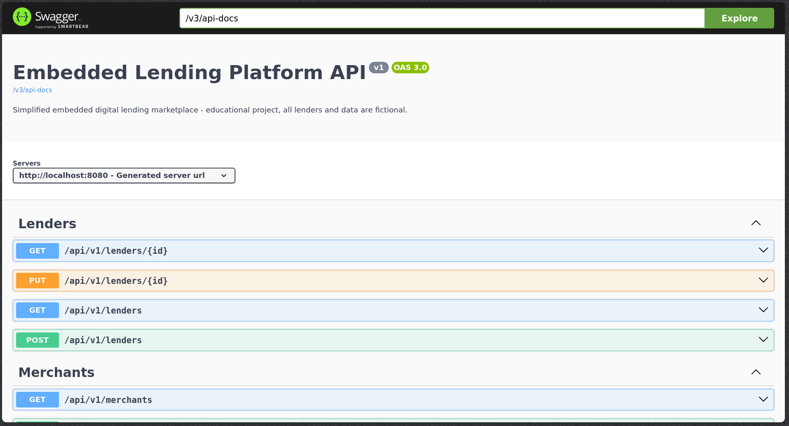
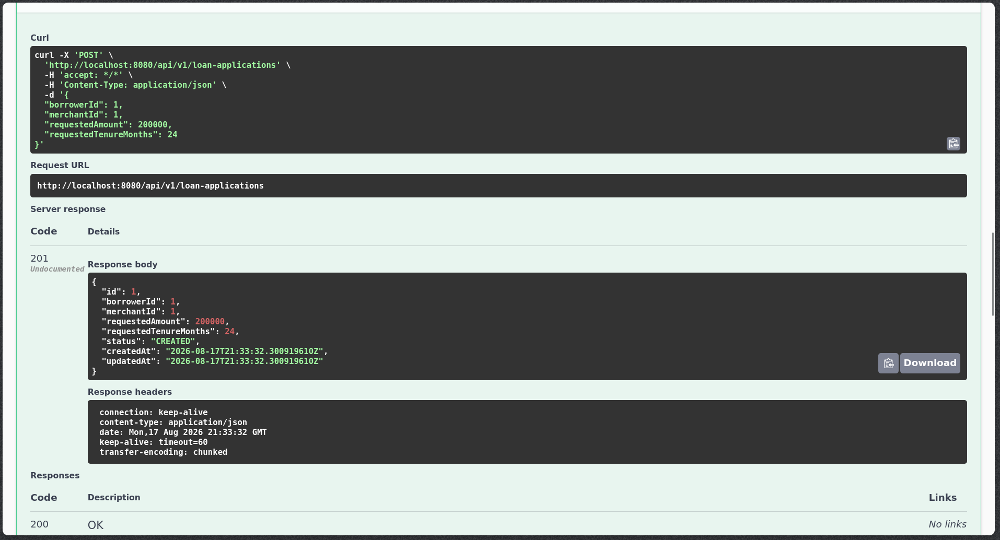

# Embedded Lending Platform

A simplified embedded lending marketplace backend. A merchant app sends a borrower's loan application, the platform checks the borrower against a set of registered lenders' eligibility rules, generates offers, and once the borrower picks one, creates the loan and its EMI repayment schedule.

This is an educational/simulation project. It does not integrate with any real bank, NBFC, UPI, Aadhaar, Account Aggregator, OCEN, RBI system or credit bureau. All lenders, borrowers and merchants in the seed data are fictional.

## Features

- Loan application creation and status tracking
- Rule-based lender eligibility engine (income, credit score, loan amount, tenure)
- Loan offer generation from eligible lenders
- Offer selection and loan approval workflow
- EMI calculation and amortization schedule generation
- Repayment tracking with partial payments
- Idempotency support on loan application creation (via Redis)
- Redis caching of lender eligibility rules
- Simple Redis-backed API rate limiting
- PostgreSQL persistence with Flyway migrations

## Tech Stack

Java 17, Spring Boot 3, Spring Data JPA, PostgreSQL, Redis, Flyway, Docker, JUnit 5, Mockito, Testcontainers

## Architecture

Modular monolith - one deployable Spring Boot app, split into packages by domain, not into separate services.

```
Client / Merchant App
        |
        v
Embedded Lending Platform (Spring Boot)
        |
        +-- borrower          borrower profile
        +-- lender            lender config + Redis-cached rules
        +-- merchant          merchant/app registry
        +-- loanapplication   application workflow orchestration
        +-- eligibility       rule-based eligibility engine
        +-- offer             loan offer generation & selection
        +-- loan              loan creation, EMI calc
        +-- repayment         repayment schedule & payments
        +-- common            errors, idempotency, rate limiting, EMI math
        |
        +---- PostgreSQL (source of truth)
        +---- Redis (cache + idempotency keys + rate limit counters)
```

Each package follows the usual Controller -> Service -> Repository layering. Packages talk to each other through service methods and plain foreign-key IDs, not JPA relationships across package boundaries - that keeps the modules loosely coupled even though they all live in one deployable.

## Running Locally

Requires Docker and Docker Compose.

```bash
git clone <this-repo-url>
cd embedded-lending-platform
docker compose up --build
```

Once it's up:
- API base URL: `http://localhost:8080/api/v1`
- Swagger UI: `http://localhost:8080/swagger-ui/index.html`

The database schema and sample data (5 borrowers, 3 lenders, 3 merchants) are loaded automatically via Flyway on startup.

To run tests locally (needs Docker running, used by Testcontainers for the integration tests):

```bash
mvn test
```

## Example Flow

1. `POST /api/v1/loan-applications` - borrower applies for a loan through a merchant app
2. `POST /api/v1/loan-applications/{id}/check-eligibility` - runs eligibility rules against every active lender, generates offers for the ones that match
3. `GET /api/v1/loan-applications/{id}/offers` - borrower sees the offers
4. `POST /api/v1/loan-applications/{id}/offers/{offerId}/select` - borrower picks one
5. `POST /api/v1/loan-applications/{id}/approve` - loan is created, EMI schedule is generated, all in one transaction
6. `GET /api/v1/loans/{id}/repayments` - view the EMI schedule
7. `POST /api/v1/loans/{id}/repayments/{repaymentId}` - simulate paying an installment, outstanding balance updates

## Idempotency

`POST /api/v1/loan-applications` accepts an optional `Idempotency-Key` header. The first request with a given key executes normally and its response is cached in Redis for 24 hours. Any retry with the same key and the same request body returns the original cached response instead of creating a second application. If the same key is reused with a *different* body, the API returns `409 DUPLICATE_REQUEST` instead of silently reusing the old response.

## Redis Caching

Lender eligibility rules (`lender:{id}:rules`) are cached with a 10 minute TTL. On an eligibility check, the app tries Redis first and only falls back to PostgreSQL on a cache miss, repopulating Redis afterwards. Updating a lender's config evicts its cache entry immediately. PostgreSQL stays the source of truth throughout - Redis is a read-through cache, not where anything financial gets stored.

## Rate Limiting

A fixed-window counter in Redis limits every `/api/v1/**` call to 60 requests/minute per client IP, and loan application creation specifically to 10/minute per borrower. Both return `429 RATE_LIMIT_EXCEEDED` once exceeded.

## Transactions

- Selecting an offer marks it `SELECTED` and expires the other offers on the same application in one transaction, so an application can never end up with two selected offers.
- Approving an application creates the `Loan` row and its full repayment schedule together in a single `@Transactional` method - if either write fails, both roll back.
- Making a repayment updates the installment and the loan's outstanding balance in one transaction. The `Loan` entity has a JPA `@Version` column, so two concurrent repayments against the same loan can't silently overwrite each other's balance update - the second one gets a `409 CONCURRENT_UPDATE` and has to retry.

## Screenshots

_Screenshots go in `screenshots/` - see the setup notes for what to capture._

<!--

*API documentation using Swagger*


*Creating a loan application*


*Loan offers generated from eligible lenders*


*Loan details and repayment schedule*


*Running the application with Docker Compose*
-->

## What I Learned

- How to design a rule-based eligibility engine using a simple interface (`EligibilityRule`) instead of reaching for a full rules engine library.
- Why idempotency keys matter for payment/loan-adjacent APIs, and that the tricky part isn't the happy path - it's deciding what to do when the same key shows up with a different request body.
- Cache-aside with Redis is simple to reason about once you're clear that Postgres is always right and Redis is disposable - if I flushed Redis right now, the app would keep working correctly, just slightly slower until the cache warms back up.
- JPA's `@Version` optimistic locking is a much simpler way to handle "two repayments hit the same loan at once" than anything involving explicit locks, for a system at this scale.
- Keeping modules talking to each other over IDs and service calls instead of JPA `@ManyToOne` relationships made it much easier to reason about which package owns which write.
